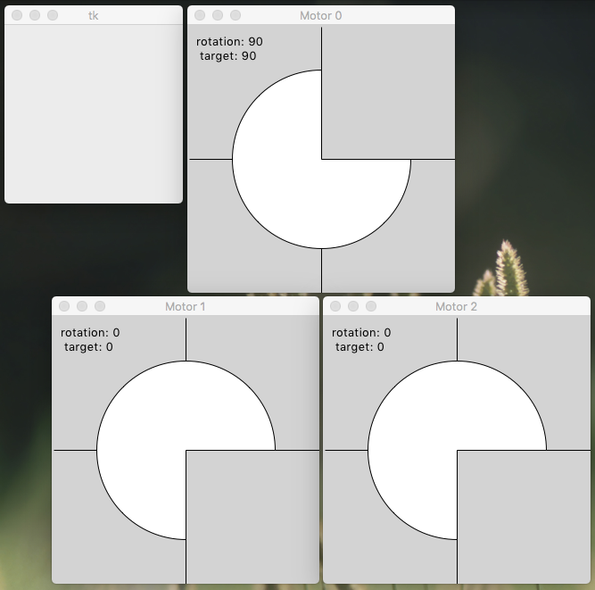

# hostTarget

Simulated target device exposes a TCP socket interface with a simple command interpreter. A separate host program acts as a client, interacting with the target and running an abstract syntax tree (AST) interpreter. Host and target can run on the same machine using the default IP address 'localhost' and default port number '12345'. Or they can be on different machines using IP addresses and a port that you've enabled for TCP communication. All of this is meant as a proof-of-concept, to give you some ideas about what's possible and what the level of effort might be for projects you have in mind.

We start in a terminal window by navigating to the right directory. Output shown is from MacOS, syntax may need adjustments for Linux and Windows. Run the Python script _target.py_ without arguments to launch a target server at port '12345'. You can run multiple servers as long as each has its own port number, but one is enough for now.

```
MarksiMac:hostTarget williamm$ pwd
/Users/williamm/Documents/Projects/asynTree/Python/hostTarget
MarksiMac:hostTarget williamm$ python3 target.py
 Usage: python3 target.py [port=12345 [file.scp]]
 listening at: ('', 12345)
@: initControl
@: setVelocity 0 3
Axis: 0, velocity: 3
@: setPosition 0 90
Axis: 0, position: 90
@: homeAxis 0
@: quit
-1 (0, 0) 1 (0, 0) 1 (0, 0)
```

Here I've started the target server and typed some commands at the console prompt. If everything is working correctly you should see some Tkinter GUI windows, as in the following screen capture. Commands are case-sensitive. Type 'help' or '?' to see a list of available commands. Note that motor axes start with zero velocity, which you have to change to make them move. Once this makes sense to you, you can run the target server again and open a socket connection to it using _telnet_, _Putty_, or any similar program.



```
MarksiMac:hostTarget williamm$ telnet localhost 12345
Trying 127.0.0.1...
Connected to localhost.
Escape character is '^]'.
@: initControl
@: setVelocity 1 -3
Axis: 1, velocity: -3
@: setPosition 1 -90
Axis: 1, position: -90
@: homeAxis 1
@: quit
Connection closed by foreign host.
MarksiMac:hostTarget williamm$
```
Here I've used command line _telnet_ to open the connection. For most commands the results and output are the same as they were at the console prompt. One exception is the 'quit' command, which when typed in _telnet_ closes the socket connection but leaves the server running. Also some commands will show a line of output on the server console, to help with troubleshooting. Type 'help' to get a list of remote commands from the server. Type '?' to get a list of local commands from the client. This proof-of-concept has no provisions for limiting or securing access to the target server. As written it even supports multiple clients connected at the same time, although they are not aware of each other. Real applications would have to address these issues.

Both the target and host programs accept script files as input for test purposes. The following example shows a test of the target server while parsing a script file _target.scp_, after which an asymmetric tree comparison in Python script _CompTree.py_ is used to check for differences between a checked-in reference file and the output file _motorX.json_. Of course if you typed the commands found in _target.scp_ at a console prompt, the results should be the same.

```
MarksiMac:hostTarget williamm$ rm motorX.json
MarksiMac:hostTarget williamm$ python3 target.py 12345 target.scp
 listening at: ('', 12345)
Reading file: target.scp.
Axis: 1, runCurrent: 500
Axis: 1, holdCurrent: 500
Axis: 0, velocity: 3
Axis: 1, velocity: 4
Axis: 2, velocity: 5
Axis: 0, acceleration: 30
Axis: 1, acceleration: 40
Axis: 2, acceleration: 50
Axis: 1, position: 400
Axis: 2, position: 300
Axis: 0, position: 200
-1 (0, 0) -1 (0, 0) -1 (0, 0)
MarksiMac:hostTarget williamm$ ../CompTree.py motorXRef.json motorX.json
[]
```

The empty square brackets show that no differences were encountered, test passed! Now we test the host side, which includes the abstract syntax tree (AST) interpreter. There are two programs hard coded into _host.py_, 'figure 1' and 'figure 2', which when serialized match those figures in the Springleik pre-print paper. Launch a target server without arguments, so it's listening at port 12345. Then in a separate terminal window run the host client with the script file _host.scp_ as input.

```
MarksiMac:hostTarget williamm$ python3 host.py localhost 12345 host.scp
@: Nothing to serialize.
@: Nothing to clear.
@: @: @: Axis: 1, runCurrent: 500
Axis: 1, holdCurrent: 500
Axis: 1, velocity: 10
Axis: 1, acceleration: 10
Axis: 1, position: 200
Axis: 1, position: 0
Axis: 1, position: 0
...
```

On exit there will be five new JSON files representing the two AST programs before and after execution.

* _one.json_ represents the 'figure 1' program before execution,
* _oneX.json_ represents the 'figure 1' program after execution, with the tree now being decorated with replies from the server,
* _two.json_ represents the 'figure 2' program before execution,
* _twoX.json_ represents the 'figure 2' program after execution, with the tree now being decorated with replies from the server, with no flags being set
* _twoY.json_ represents the 'figure 2' program after execution, with the tree now being decorated with replies from the server, with one flag being set.

One can use _git_ to check for differences between these output files and checked-in references.

```
MarksiMac:hostTarget williamm$ git diff *.json
MarksiMac:hostTarget williamm$
```

No output, so no differences! Now you get to try the host client program, to see how this AST thing actually works.
