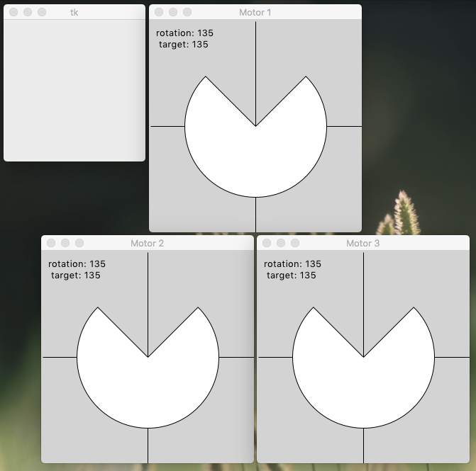

# toyMotor

Self-contained GUI demo uses Tkinter to simulate a three-axis motion control system run by an AST interpreter. Run it at the command line without arguments to get a console prompt and some GUI windows. Here is what that looks like in a MacOS terminal window. Windows and Linux require minor adjustments to the syntax.

```
MarksiMac:toyMotor williamm$ pwd
/Users/williamm/Documents/Projects/asynTree/Python/toyMotor

MarksiMac:toyMotor williamm$ python3 toyMotor.py
@: r
@: q
15 (135, 135) 15 (135, 135) 15 (135, 135)

MarksiMac:toyMotor williamm$ python3 ../CompTree.py motorXRef.json motorX.json
[]

MarksiMac:toyMotor williamm$ python3 ../CompTree.py ctrlXRef.json ctrlX.json
[]

MarksiMac:toyMotor williamm$ python3 pseudoCode.py > pseudoCode.txt
MarksiMac:toyMotor williamm$ git diff pseudoCode.txt
```

Check that you have navigated to the right folder. Run the Python script _toyMotor.py_ without arguments to obtain a console prompt and some GUI windows (screen capture below). Only two single-letter commands are accepted: 'r' to run and 'q' to quit. Type the 'r' run command and press [ENTER]. The demo should run for about a minute, going through its sequence several times. Type 'q' to quit the program. On exit the program writes two output files, _motorX.json_ and _ctrlX.json_. These can be compared to checked-in reference files with an asymmetric JSON tree comparison using the Python script _CompTree.py_ one level up. The empty square brackets show that no changes were found. A better understanding of the AST interpreter's command tree can be obtained by rendering its JSON representation in _ctrlX.json_ as pseudocode using the Python script _pseudoCode.py_. Here I've redirected the output to a text file, and then used _git_ to compare it with a checked-in version. No differences means test passed!


